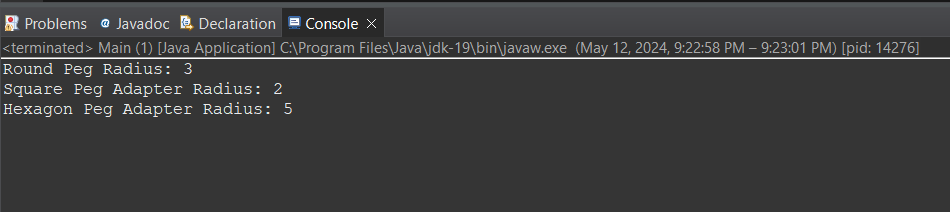

# Adapter Design Pattern Report
---
## Introduction
The diagram that is provided serves as an example of the Adapter design pattern, a structural design pattern that is used to balance the variations between different classes' interfaces. In this case, the code addresses the problem of incorporating hexagonal and square pegs into a system that was intended to accommodate round pegs. 

This is accomplished with the Adapter design, which introduces intermediate adapter classes that convert the incompatible classes' interfaces into ones that the client code may use. This improves the modularity, reusability, and flexibility of the code by enabling items with incompatible interfaces to work together seamlessly.

This implementation of the code demonstrates the adaptability of the Adapter pattern in addressing interface mismatches, hence facilitating the integration of various components into a system without requiring significant alterations.


### Building the Application from git repo

To manually build the application from the git repository, follow these steps:

1. **Clone the git repository**: 
   - Open a terminal or command prompt.
   - Navigate to the directory where you want to clone the repository.
   - Run the following command:
     ```
     git clone <repository_url>
     ```
   Replace `<repository_url>` with the URL of the git repository.

2. **Navigate to the project directory**: 
   - Once the cloning process is complete, navigate into the project directory using the terminal or command prompt:
     ```
     cd Adapter-Design-Pattern
     ```

3. **Compile the Java files**: 
   - With the terminal or command prompt still open and inside the project directory, compile the Java source files. 
   - Use the following command:
     ```
     javac *.java
     ```
   This command compiles all Java files in the current directory.

4. **Run the main class**: 
   - After successful compilation, execute the main class to run the application.
   - Use the following command:
     ```
     java Main
     ```
   This command runs the main class, which demonstrates the functionality of the Adapter design pattern.

## GitHub Repository

The source code for this project is available on GitHub at: [Adapter-Design-Pattern](<repository_url>)

## Key Code & Explanations
```java
import java.lang.Math;

// Step 1: Create RoundHole class
class RoundHole {
    private int radius;

    public RoundHole(int radius) {
        this.radius = radius;
    }

    public int getRadius() {
        return radius;
    }
}

// Step 2: Create RoundPeg interface
interface RoundPeg {
    int getRadius();
}

// Step 3 & 4: Create SquarePegAdapter class
class SquarePegAdapter implements RoundPeg {
    private SquarePeg squarePeg;

    public SquarePegAdapter(SquarePeg squarePeg) {
        this.squarePeg = squarePeg;
    }

    @Override
    public int getRadius() {
        // Calculate the equivalent radius for square peg
        return (int) (squarePeg.getSideLength() * Math.sqrt(2) / 2);
    }
}

// Step 5: Create HexagonPeg class
class HexagonPeg {
    private int sideLength;

    public HexagonPeg(int sideLength) {
        this.sideLength = sideLength;
    }

    public int getSideLength() {
        return sideLength;
    }
}

// Step 6 & 7: Create HexagonPegAdapter class
class HexagonPegAdapter implements RoundPeg {
    private HexagonPeg hexagonPeg;

    public HexagonPegAdapter(HexagonPeg hexagonPeg) {
        this.hexagonPeg = hexagonPeg;
    }

    @Override
    public int getRadius() {
        // Calculate the equivalent radius for hexagon peg
        return (int) (hexagonPeg.getSideLength() * Math.sqrt(3) / 2);
    }
}

public class Main {
    public static void main(String[] args) {
        // Step 8: Create objects
        RoundHole roundHole = new RoundHole(5);
        RoundPeg roundPeg = new RoundPeg() {
            @Override
            public int getRadius() {
                return 3; // Just an example, you can replace it with any desired value
            }
        };
        SquarePegAdapter squarePegAdapter = new SquarePegAdapter(new SquarePeg(4));
        HexagonPeg hexagonPeg = new HexagonPeg(6);
        HexagonPegAdapter hexagonPegAdapter = new HexagonPegAdapter(hexagonPeg);

        // Step 9: Test and print results
        System.out.println("Round Peg Radius: " + roundPeg.getRadius());
        System.out.println("Square Peg Adapter Radius: " + squarePegAdapter.getRadius());
        System.out.println("Hexagon Peg Adapter Radius: " + hexagonPegAdapter.getRadius());

        // Step 10: Verify the adapter classes
        // You can manually verify if the calculated radii are correct based on the formulas provided.
    }
}
```

1. **RoundHole class**:
   - Represents a round hole with a certain radius.
   - Contains a constructor to initialize the radius and a method to retrieve the radius.

2. **RoundPeg interface**:
   - Defines an interface for round pegs.
   - Contains a method `getRadius()` to retrieve the radius of the peg.

3. **SquarePegAdapter class**:
   - Adapts the SquarePeg class to fit the RoundPeg interface.
   - Implements the `RoundPeg` interface and contains a composition relationship with the `SquarePeg` class.
   - Calculates the equivalent radius for a square peg using the formula provided (`radius = sideLength * √2 / 2`).

4. **HexagonPeg class**:
   - Represents a hexagon peg with a certain side length.
   - Contains a constructor to initialize the side length and a method to retrieve the side length.

5. **HexagonPegAdapter class**:
   - Adapts the HexagonPeg class to fit the RoundPeg interface.
   - Implements the `RoundPeg` interface and contains a composition relationship with the `HexagonPeg` class.
   - Calculates the equivalent radius for a hexagon peg using the formula provided (`radius = sideLength * √3 / 2`).

6. **Main class**:
   - Contains the `main` method to demonstrate the functionality of the adapter classes.
   - Creates objects of RoundHole, RoundPeg, SquarePegAdapter, HexagonPeg, and HexagonPegAdapter classes.
   - Tests and prints the results by calling the `getRadius()` method on each object.

#### How it works:
- The RoundHole class represents a round hole with a certain radius. The RoundPeg interface defines an interface for round pegs with a method to retrieve the radius.
- The SquarePegAdapter class adapts the SquarePeg class to fit the RoundPeg interface. It calculates the equivalent radius for a square peg using the provided formula.
- Similarly, the HexagonPegAdapter class adapts the HexagonPeg class to fit the RoundPeg interface and calculates the equivalent radius for a hexagon peg.
- In the Main class, objects of RoundHole, RoundPeg, SquarePegAdapter, HexagonPeg, and HexagonPegAdapter classes are created and tested. The results are printed to verify the functionality of the adapter classes.

#### Use of Adapter Pattern:
- The Adapter pattern allows objects with incompatible interfaces to work together.
- In this code, the SquarePegAdapter and HexagonPegAdapter classes act as adapters, allowing square and hexagon pegs to be used in place of round pegs by adapting their interfaces to match the RoundPeg interface.
- This pattern promotes code reusability and flexibility by enabling the integration of new classes or systems without modifying existing code.

## Verification of Program Functionality

We can run the application and look at the results to confirm that the program is working properly. The output ought to show the round peg's radius, the square peg adapter's radius, and the hexagon peg adapter's radius.



## Development Challenges:

1. **Mathematical methods**: It can be difficult to come up with precise methods to determine the equivalent radius for hexagon and square pegs. It is crucial to make sure that these formulas consistently yield results and appropriately represent the geometrical features of the pegs.

2. **Adherence to Design standards**: It can be difficult to strike a balance between the duties of the adapter classes and design standards like the Single Responsibility Principle (SRP). It is imperative to guarantee that the adapters translate interfaces efficiently while avoiding superfluous complexity and design principles violations.

3. **Testing**: It is difficult to fully test the adapter classes to ensure accuracy and dependability. This involves confirming that, in the context of a round hole, the computed radii appropriately represent the comparable values for square and hexagon pegs. Extensive testing processes are necessary to handle boundary conditions and edge cases effectively.

4. **Integration**: It is a difficulty to smoothly include the adapter classes into the current system architecture without causing any disruptions or adding dependencies. It is crucial to make sure that the adapters allow for the smooth integration of various components into the system while preserving consistency and compatibility.

5. **Performance**: It can be difficult to maximize the adapter classes' performance, particularly for intricate computations. To guarantee that the adapters satisfy the system's performance requirements, it is essential to strike a balance between computational efficiency, accuracy, and maintainability.

## Solutions to Development Challenges:


1. **Mathematical Formulas**: To guarantee correctness and consistency, thoroughly research and validate mathematical formulas.

   Test the formulas extensively using a range of input values to ensure that they are accurate.
   Employ the mathematical functions or libraries that the programming language offers to precisely perform intricate computations.

2. **Adherence to Design Principles** : - Divide the adapter classes' duties into coherent and controllable parts.
   - To guarantee modular and maintainable code, follow design patterns like the Adapter pattern and abide by concepts like the Single Responsibility Principle (SRP).
   - Perform code reviews and reworking sessions in order to find and fix any design principle breaches.

3. **Testing**: - Create thorough test cases that address a range of situations, including as edge cases, boundary conditions, and normal instances.
   To increase test coverage and expedite the testing process, make use of automated testing frameworks and tools.
   Regression testing should be done to make sure that modifications don't result in new flaws or regressions.
   - Create efficient test cases by using strategies like boundary value analysis and equivalency partitioning.

4. **Integration** : - Integration of the adapter classes should be done gradually, beginning with isolated, tiny components and increasing integration as adapters gain more trust.
   - To simplify integration and disconnect components, use frameworks for inversion of control (IoC) or dependency injection.
   - Test the integration of the adapters with other system components to ensure that they are consistent and compatible.

5. **Performance**: - Profile the adapter classes to find any bottlenecks and streamline important code segments.
   - Use caching techniques or algorithmic tweaks to increase computation efficiency.
   - To spread the computational burden and boost performance, think about utilizing concurrency or parallelism when appropriate.
   - Constantly track and compare the adapters' performance to pinpoint areas in need of fine-tuning and streamlining.


## Conclusion

To sum up, there are a number of obstacles to overcome and a thorough evaluation of the design, testing, and performance factors involved in implementing the Adapter design pattern for integrating square and hexagon pegs into a system intended for round pegs. The Adapter design promotes modularity, adaptability, and maintainability while facilitating the smooth integration of diverse components inside the system by addressing these issues and putting appropriate solutions in place.

The adapter classes can successfully span the gap between incompatible interfaces by means of careful research, rigorous testing, adherence to design principles, and optimization efforts; this allows the system to accommodate various types of pegs without sacrificing functionality or adding complexity.

Moreover, the effective application of the Adapter pattern not only takes care of the pressing need to integrate square and hexagon pegs, but it also establishes the framework for extensibility and scalability, which makes it possible for the system to grow and change in the future with little difficulty.

All things considered, the Adapter design pattern is a useful tool in software development that provides a strong and adaptable means of resolving interface discrepancies and encouraging component compatibility. Developers may improve the adaptability and usability of their systems and, in turn, provide end users with more reliable and flexible solutions by utilizing the Adapter pattern efficiently.


---
